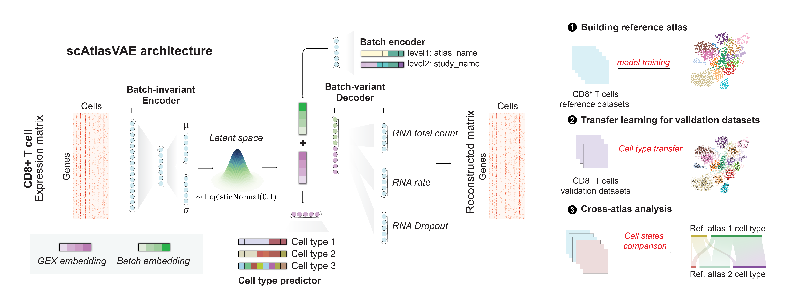

# scAtlasVAE

scAtlasVAE is a method for rapid atlas-level integration of large-scale scRNA-seq datasets and data transfer for query datasets. 




## Documentation

[Documentation](https://scatlasvae.readthedocs.io/en/latest/)

## Installation

### Using PyPI

```shell
pip3 install scatlasvae
```

### Install PyTorch 

Please see the [PyTorch official website](https://pytorch.org/) for installing GPU-enabled versino of PyTorch.

```python
# Testing if CUDA is available
import torch
print(torch.__version__)
print(torch.cuda.is_available())
```

scAtlasVAE was tested on NVIDIA RTX2080Ti, RTX3090Ti, A10, A100, and A800 device on Ubuntu 20.04.

## Usage

```python
import scatlasvae

adata = scatlasvae.read_h5ad("path_to_adata")
vae_model = scatlasvae.model.scAtlasVAE(
    adata,
    batch_key="sample_name"
)
vae_model.fit()
```

See complete usage guidance at [Integration tutorial](https://scatlasvae.readthedocs.io/en/latest/gex_integration.html)