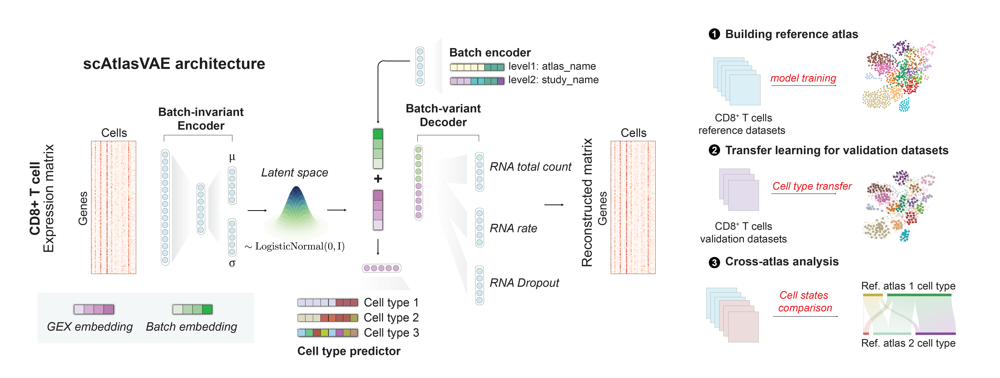

Introduction
============

scAtlasVAE is a method for rapid atlas-level integration of large-scale scRNA-seq datasets and accurate data transfer for query datasets. 

Installation
------------

Install via PyPI:

.. code-block:: bash
  :linenos:
    # Install the cuda enabled version
    pip install scatlasvae[gpu]
    # Install the cpu version
    pip install scatlasvae[cpu]

Install from source:

.. code-block:: bash
  :linenos:

    git clone git@github.com:WanluLiuLab/scAtlasVAE.git
    cd scAtlasVAE
    pip3 install -r requirements.txt
    python3 setup.py install

Tutorial 
--------

Basic Usage
~~~~~~~~~~~

.. code-block:: python
  :linenos:

  import scatlasvae

  # Load the data
  adata = scatlasvae.read_h5ad("path/to/data.h5ad")
  vae_model = scatlasvae.model.scAtlasVAE(
    adata=adata,
    batch_key="sample_name", 
  )
  vae_model.fit()

See :doc:`gex_integration` for more details.
See :doc:`gex_transfer` for more details.

Key functionality
-----------------

Task 1: Building reference atlas from scatch
^^^^^^^^^^^^^^^^^^^^^^^^^^^^^^^^^^^^^^^^^^^^

scAtlasVAE can be used to build reference atlas without prior cell type annotation. 
The reference atlas can be used for downstream tasks such as query-to-reference mapping and multi-atlas integration. 
See :doc:`gex_integration` for more details.`

Task 2: Query-to-reference mapping with cell type annotation
^^^^^^^^^^^^^^^^^^^^^^^^^^^^^^^^^^^^^^^^^^^^^^^^^^^^^^^^^^^^

scAtlasVAE can be used to map query dataset to reference atlas with cell type annotation. 
The query dataset can be used for downstream tasks such as multi-atlas integration.
See :doc:`gex_transfer` for more details.

Task 3: Multi-atlas integration with cell type alignment
^^^^^^^^^^^^^^^^^^^^^^^^^^^^^^^^^^^^^^^^^^^^^^^^^^^^^^^^

  

scAtlasVAE can be used to build reference atlas without prior cell type annotation. The reference atlas can be used for downstream tasks such as query-to-reference mapping and multi-atlas integration. 
See :doc:`gex_integration` for more details.
See :ref:`Tools` for more details.

Model architecture
------------------

The scAtlasVAE model is based on a variational autoencoder with a batch-invariant encoder and a batch-variant decoder. The batch-invariant encoder 
accepts raw gene expression count transformed by NormalizeTotal operation (optional) and Log1p operation as input. The multi-layer perceptron (MLP)
of the encoder project the gene expression matrix to an mean and variance of the latent representation of each cell. 
the batch index of each cell is annotated as :math:`\mathbf{B}\ =\{ {B}_1,\ldots,B_n \} \in \mathbb{R}^H,\ B_n=\ \{ b_{n,1},\ldots,b_{n,L} \}`, where :math:`L` is the number of levels of batches. If cell subtype annotation is available, the label index of as :math:`{\mathbf{C}\ = \{C}_1,\ldots,C_n \}\in\mathbb{R}^A,\  C_n\ =\{C_{n,1},\ldots,C_{n,A}\}` where :math:`A` is the number of categories of annotations. 

The batch-variant decoder is composed of an embedding module that embeds the batch information :math:`\mathbf{B}` to an batch embedding and a MLP layer that accepts the concatenated
embedding of the cell latent representation :math:`\mathbf{z}` and the batch embedding. The MLP layer outputs the mean, variance, and dropout probability (:math:`r_{mean},r_{var},r_{gate}`) of the gene expression value for 
each cell for fitting an zero-inflated negative binomial (ZINB) distribution.

scAtlasVAE was trained on random sampled batches of datasets to minimize the log-likelihood on the observed single-cell sequencing data :math:`\mathbf{X}` and by default, we use zero-inflated negative binomial distribution: 

.. math::

    \begin{align}
    p_\theta (\mathbf{X}\ |\ \mathbf{B})\ &=\ \int_{z}^{\ }{p_\theta(\mathbf{X}\ |\ \mathbf{z},\ \mathbf{B})p_\theta(\mathbf{z})d\mathbf{z}} \\
    p_\theta\left(\mathbf{X}=\hat{\mathbf{X}}\right) &= \mathrm{ZINB}\left(\mathbf{X}=\hat{\mathbf{X}}\ \middle|\ r_{mean},r_{var},r_{gate}\right)
    \end{align}

scAtlasVAE includes cell type predictor :math:`\mathcal{F}_{\mathrm{celltype}}(\mathbf{z})\ = \{{f_{\mathrm{celltype}}}_1,\ldots,{f_{\mathrm{celltype}}}_A \}` for independent prediction of different cell type categories. The cell type loss is defined as 

.. math::

    \mathcal{L}_{\mathrm{celltype}}=\sum_{n}^{N}{\sum_{a}^{A}{-{w_{\hat{y}}}_{a,n}}log\frac{\mathrm{exp}\left({f_{{\mathrm{celltype}}_a}(x_{a,n})}_{{\hat{y}}_{a,n}}\right)}{\sum_{c=1}^{C_a}\mathrm{exp}\left({f_{{\mathrm{celltype}}_a}(x_{a,n})}_c\right)}\times1{{\hat{y}}_{a,n}\neq{\mathrm{ignore\_index}}_{a,n}}}

where :math:`C_a` is the number of cell types in category a, :math:`{f_{{celltype}_a}\left(x_{a,n}\right)}_c` is the logits of cell type prediction for cell type :math:`c`, :math:`{\hat{y}}_{a,n}`  is the ground truth cell type of category :math:`a` for cell :math:`n`. :math:`{w_{\hat{y}}}_{a,n}` is the weight of cell type :math:`{\hat{y}}_{a,n}` inversely proportional to the number of cell types in category :math:`a`. The :math:`{ \mathrm{ignore\_index}}_a` indicates whether the cell type a is available for cell :math:`n`. 

